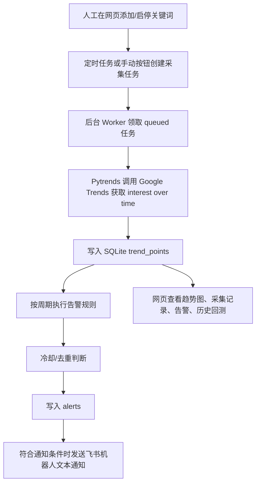

# Google Trends Monitor 程序运行流程说明

本文档说明当前 MVP 的运行链路：关键词从哪里配置，数据从哪里采集，采集后如何入库、分析、去重，最后如何按告警类型决定是否发送飞书通知。

## 1. 整体流程



核心入口文件：

- Web 应用和页面路由：`googletrends_app/main.py`
- 采集、分析、告警判断：`googletrends_app/collector.py`
- Google Trends 采集适配：`googletrends_app/trends.py`
- 后台任务执行：`googletrends_app/worker.py`
- SQLite 读写：`googletrends_app/repository.py`
- 飞书通知：`googletrends_app/notifier.py`
- 历史回测：`googletrends_app/backtest.py`

## 2. 关键词从哪里来

关键词由人工在网页管理页维护：

- 页面：`/`
- 新增关键词：提交 `POST /keywords`
- 启用/暂停关键词：提交 `POST /keywords/{keyword_id}/toggle`
- 删除关键词：提交 `POST /keywords/{keyword_id}/delete`

关键词保存到 SQLite 的 `keywords` 表。

只有 `enabled = 1` 的关键词会被定时采集。暂停后的关键词仍保留历史数据，但不会继续创建新的定时采集任务。

## 3. 采集任务如何产生

系统支持两种方式产生采集任务。

### 3.1 定时采集

应用启动时，如果 `GOOGLETRENDS_SCHEDULER` 没有设置为 `0`，会启动 APScheduler。

当前定时策略：

- 每小时第 5 分钟：为启用了短周期的关键词创建 `now 1-d` / `now 7-d` 采集任务
- 每天北京时间 02:00：为启用了中长期周期的关键词创建 `today 1-m` / `today 3-m` / `today 12-m` / `today 5-y` 采集任务
- 每 1 分钟：启动一次后台 Worker，处理排队中的采集任务

对应逻辑在 `googletrends_app/main.py` 的 `create_app()` 里。

### 3.2 手动采集

网页上点击“立即采集”后，会按每个关键词自己配置的周期创建任务。默认新关键词只启用：

- `now 7-d`
- `today 3-m`

可选周期包括：

- `now 1-d`
- `now 7-d`
- `today 1-m`
- `today 3-m`
- `today 12-m`
- `today 5-y`

任务保存到 `collection_jobs` 表。系统会避免同一个关键词、同一个周期、同一个地区在已有 `queued` 或 `running` 任务时重复创建任务。

## 4. 数据从哪里采集

采集代码在 `googletrends_app/trends.py`。

当前使用 `pytrends`：

```python
pytrends = TrendReq(hl="en-US", tz=480)
pytrends.build_payload([term], timeframe=timeframe, geo=geo)
data = pytrends.interest_over_time()
```

含义：

- `term`：人工配置的关键词
- `geo=""`：全球范围
- `timeframe`：采集窗口，例如 `now 7-d`、`today 3-m`，也可以按关键词启用其他可选周期
- `tz=480`：北京时间 UTC+8
- `interest_over_time()`：获取 Google Trends 的时间序列热度数据

注意：`pytrends` 不是 Google 官方公开 API，而是封装 Google Trends 网页背后的接口。低成本 MVP 可以用，但稳定性依赖 Google Trends 页面接口是否变化。

采集结果会被转换成统一结构：

- `date`：趋势点时间
- `value`：Google Trends 的 0-100 相对热度
- `is_partial`：Google 返回的未完整周期标记

## 5. 采集数据如何入库

Worker 领取任务后执行 `collector.process_collection_job()`。

成功采集后，数据写入 `trend_points` 表：

- `keyword_id`：关键词 ID
- `point_date`：趋势点时间
- `value`：0-100 相对热度
- `is_partial`：是否为未完整周期
- `geo`：地区，当前全球为空字符串
- `timeframe`：采集窗口
- `collected_at`：本次采集时间

`trend_points` 有唯一键：

```text
(keyword_id, point_date, geo, timeframe)
```

因此同一个关键词、同一个周期、同一个时间点重复采集时，会更新已有数据，而不是插入重复行。这一点很重要，因为 Google Trends 的当天或当周数据可能在之后发生变化。

## 6. 采集后如何分析判断

每个采集任务成功写入数据后，会立即执行：

```python
evaluate_alerts(conn, keyword_id, timeframe=job_timeframe)
```

分析逻辑在 `googletrends_app/collector.py`。

### 6.1 分周期判断

系统按采集窗口选择不同规则：

- `now 1-d` / `now 7-d`：短线雷达，关注突然暴增、小幅升温、快速下跌、明显回落
- `today 1-m` / `today 3-m`：中期确认，关注周期高位、连续走强、连续回落
- `today 12-m` / `today 5-y`：长期参照，关注当前周期高位、长期上行、长期下行

### 6.2 partial 数据处理

- `now 1-d` / `now 7-d`：保留 partial 点，因为短线监控需要尽早发现变化
- `today ...` 系列：过滤 partial 点，避免未完整周期造成误判

### 6.3 短周期 `now 1-d` / `now 7-d` 规则

短周期至少需要 12 个点。

判断方式：

- 取最近 2-3 个点做 `recent_avg`
- 取之前一段点做 `baseline`
- 比较 `recent_avg` 与 `baseline`

当前规则：

- `sudden_spike`，P1：短线搜索热度暴增，可能进入快速传播阶段
- `warming_up`，P2：短线搜索热度小幅升温，建议观察是否持续放量
- `sudden_drop`，P1：短线搜索热度快速下跌，可能出现热度暴毙
- `cooling_down`，P2：短线搜索热度明显回落，建议确认是否失去动能

### 6.4 中周期 `today 1-m` / `today 3-m` 规则

中周期至少需要 17 个点。

判断方式：

- 取最近 3 个点做 `recent_avg`
- 取之前 14 个点做 `baseline`
- 同时参考之前窗口里的峰值 `previous_peak`

当前规则：

- `window_breakout`，P1：接近当前周期高位
- `steady_rise`，P2：中期连续走强
- `steady_decline`，P2：中期连续回落

### 6.5 长周期 `today 12-m` / `today 5-y` 规则

长周期至少需要 10 个点。

判断方式：

- 取最近 2 个点做 `recent_avg`
- 取之前 8 个点做 `baseline`
- 同时检查最新值是否接近历史高位

当前规则：

- `historical_hot`，P1：长期窗口接近 12 个月高位
- `long_rise`，P2：长期窗口明显上行
- `long_decline`，P2：长期窗口明显下行

## 7. 0-100 热度值如何理解

Google Trends 返回的 `value` 是相对热度，不是搜索量绝对值。

在同一次查询、同一个关键词、同一个时间窗口里：

- `100` 表示这个窗口内的最高相对热度点
- `50` 大致表示相对于最高点的一半热度
- `0` 不代表绝对没有搜索，通常表示数据不足或相对值太低

所以系统判断“暴增/升温/下跌”时，不直接把 `80` 理解为固定流量，而是比较最近热度与历史基线的相对变化。

## 8. 告警如何去重和冷却

系统有两层控制，避免飞书噪音。

### 8.1 数据库唯一去重

`alerts` 表有唯一键：

```text
(keyword_id, rule, point_date)
```

同一个关键词、同一条规则、同一个触发点，只会插入一次。

### 8.2 冷却窗口

在真正写入告警前，系统会检查最近是否已经出现过同类告警。

冷却维度：

```text
keyword_id + severity + category + timeframe
```

默认冷却时间：

- P1：6 小时
- P2：24 小时

对应环境变量：

```bash
GOOGLETRENDS_P1_ALERT_COOLDOWN_HOURS=6
GOOGLETRENDS_P2_ALERT_COOLDOWN_HOURS=24
```

这样做的结果：

- 同一个关键词持续升温时，不会每次采集都刷屏
- P2 升级成 P1 时不会被 P2 冷却挡住，因为 severity 不同
- 不同类型的风险会分别告警，例如上涨和下跌不会互相覆盖

## 9. 告警如何通知飞书

通知逻辑在 `googletrends_app/notifier.py`。

如果配置了 `FEISHU_WEBHOOK_URL`，系统会使用飞书机器人 webhook 发送文本消息：

```json
{
  "msg_type": "text",
  "content": {
    "text": "..."
  }
}
```

如果没有配置 `FEISHU_WEBHOOK_URL`，系统使用 `NullNotifier`，不会真正发送通知。

并不是所有入库告警都会发送飞书。当前策略是：

- 发送飞书：`sudden_spike`、`warming_up`、`window_breakout`、`steady_rise`、`historical_hot`、`long_rise`
- 不发送飞书，只入库并在页面/回测里展示：`sudden_drop`、`cooling_down`、`steady_decline`、`long_decline`

这样可以保留“热度回落/暴毙”的历史判断能力，同时避免飞书被回落类消息刷屏。

告警消息由 `collector.format_alert_notification()` 生成，包含：

- 告警级别
- 关键词
- 告警类型
- 采集窗口
- 触发时间点，北京时间，格式 `YYYY-MM-DD HH:MM:SS`
- 当前值
- 基线值
- 变化百分比
- 规则说明
- 建议动作
- 关键词详情页链接

页面链接由 `GOOGLETRENDS_PUBLIC_BASE_URL` 拼接：

```bash
GOOGLETRENDS_PUBLIC_BASE_URL=http://127.0.0.1:8000
```

如果部署到服务器，需要把它改成用户能访问的真实域名或内网地址。

## 10. 采集失败如何处理

采集任务失败后，系统会看当前尝试次数。

- 如果还没有达到 `max_attempts`：任务重新变回 `queued`，等待下次重试
- 如果达到 `max_attempts`：任务标记为 `failed`，并发送飞书失败通知

相关配置：

```bash
GOOGLETRENDS_MAX_ATTEMPTS=3
GOOGLETRENDS_RETRY_DELAY_SECONDS=300
GOOGLETRENDS_REQUEST_DELAY_SECONDS=2
```

含义：

- `GOOGLETRENDS_MAX_ATTEMPTS`：单个任务最多尝试次数
- `GOOGLETRENDS_RETRY_DELAY_SECONDS`：失败后多久重试
- `GOOGLETRENDS_REQUEST_DELAY_SECONDS`：连续采集任务之间的间隔，避免请求过密

## 11. 历史回测如何工作

页面：`/backtest`

回测逻辑在 `googletrends_app/backtest.py`。

回测不会请求 Google，也不会写入真实告警，更不会发送飞书通知。它只读取 SQLite 中已有的 `trend_points`。

回测方式：

1. 选择关键词和周期
2. 按时间顺序读取历史趋势点
3. 从满足最少点数的位置开始，模拟“当时只能看到这些历史点”
4. 对每个时间切片执行同一套告警规则
5. 应用同样的冷却逻辑
6. 在页面列出模拟触发记录

回测结果可以用来判断：

- 规则是否太敏感，导致频繁触发
- 规则是否太迟钝，错过早期升温
- 哪些类型的告警更有价值
- P1/P2 阈值和冷却时间是否需要调整

## 12. 页面入口

当前网页入口：

- `/`：关键词管理
- `/keywords/{keyword_id}`：关键词详情和趋势图
- `/runs`：采集任务记录
- `/alerts`：真实告警记录
- `/backtest`：历史回测

所有页面展示时间都按北京时间显示，格式：

```text
2026-05-17 11:00:00
```

## 13. 当前 MVP 的边界

当前版本已经能完成：

- 人工维护关键词
- 全球 Google Trends 定时采集
- 多周期趋势判断
- 告警冷却/去重
- 飞书机器人通知
- 历史回测
- 简单网页管理

当前版本还没有做：

- 多关键词相互对比归一化
- 对真实搜索量的估算
- 更复杂的异常检测模型
- 用户权限和登录
- 告警确认、处理状态、负责人流转
- 多 webhook、多渠道通知
